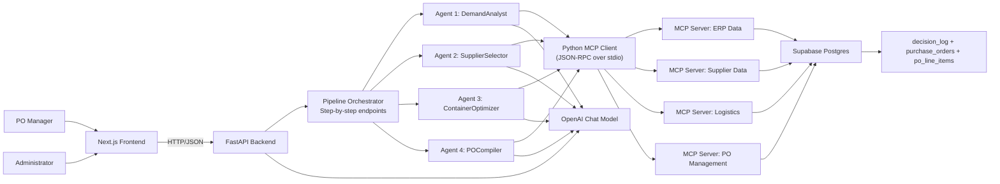

# ProcureAI Technical Design Document (2-3 pages)

## 1) System Overview

ProcureAI is a multi-agent supply chain purchase-order drafting system.
It supports a planner workflow where AI agents propose replenishment and sourcing decisions, while humans retain final approval authority.

Core stack:
- Frontend: Next.js App Router
- Backend: FastAPI (Python)
- Agent orchestration: LangGraph nodes + stepwise FastAPI endpoints
- Tooling protocol: MCP (Model Context Protocol) over stdio JSON-RPC
- Persistence: Supabase (PostgreSQL + Auth)
- LLM: OpenAI (`OPENAI_MODEL`, default `gpt-4o-mini`)

## 2) Architecture Diagram

## 3) Agent Roles and Decision Boundaries

### DemandAnalyst
Purpose:
- Convert inventory and demand signals into replenishment requirements.

Inputs:
- `erp:get_inventory`
- `erp:get_forecasts` (including historical actuals for sales delta)
- `po:get_pos` (open PO enrichment — cross-references existing orders to prevent double-buying)

Decision logic:
- Net need: `max(0, forecast + safety_stock - (current_stock + in_transit))`
- MOQ floor: if `net_qty > 0 and net_qty < moq`, round up to `moq`
- Urgency tiering: `critical` if `current_stock <= safety_stock`; `watch` if `current_stock <= reorder_point`; `normal` otherwise
- Need-by date: `today + (current_stock / (forecast / horizon / 30))` days
- Sales delta: compares last 3 months actuals vs prior 3 months (`% change`)
- Open PO warning: surfaces `open_po_count` and `open_po_qty` per SKU

Boundary:
- Does not select suppliers or create POs

### SupplierSelector
Purpose:
- Select best supplier per SKU.

Inputs:
- Prior agent net requirements
- `supplier:score_suppliers` (per SKU + order_qty)

Decision logic — scoring formula (all metrics 0–100):
- `lead_time_score = max(0, 100 - (lead_time_days - 7) * (100/21))`  [7 days → 100, 28 days → 0]
- `cost_score = supplier.cost_rating`
- `moq_fit = 100 if order_qty >= moq, else (order_qty / moq) * 100`
- `total_score = quality * w.quality + delivery * w.delivery + lead_time * w.lead_time + cost * w.cost`
- Weights (`w`) are **read per product category** from `supplier_scoring_weights` table — configurable without code change
- Returns primary recommended supplier + top 2–3 alternatives; planner can switch before next stage

Boundary:
- Does not optimize logistics or persist POs

### ContainerOptimizer
Purpose:
- Determine container recommendation and estimated freight.

Inputs:
- Chosen suppliers + quantities
- `erp:get_products` (weight/CBM per unit)
- `logistics:calculate_container_plan`

Decision logic — bin packing:
- `total_weight_kg = sum(qty * unit_weight_kg)` across all line items
- `total_cbm = sum(qty * unit_cbm)`
- For each container type: `num_containers = max(ceil(total_weight / max_weight), ceil(total_cbm / max_cbm))`
- `binding_utilisation = max(weight_fill%, volume_fill%)` — the binding dimension drives container count
- Recommends the plan with highest binding utilisation (most efficient use of capacity)

Boundary:
- Does not create final PO records

### POCompiler
Purpose:
- Persist draft PO and line items, produce PO summary.

Inputs:
- Finalized line items and container plan
- `po:create_draft_po`

Decision logic:
- Calculates subtotal + freight estimate + total

Boundary:
- Does not auto-approve POs

Implementation note:
- Persisted `purchase_orders.total_usd` is currently line-item subtotal only in PO MCP server; freight is included in pipeline-side computed total/rationale.

## 4) MCP Usage and Context Flow

MCP design in this project:
- Python backend calls Node MCP servers using JSON-RPC over stdio.
- For each call, client sends `initialize` then `tools/call`.
- Tool response payload is parsed and returned to agent node.

Example context flow (SupplierSelector):
1. SupplierSelector receives `net_requirements` from pipeline state.
2. For each SKU, it calls `supplier:score_suppliers` with `sku` and `order_qty`.
3. Supplier MCP server reads:
- `products` (category/MOQ)
- `supplier_scoring_weights` (category policy)
- `supplier_products` + supplier metrics
4. MCP server returns ranked candidates + recommended supplier.
5. Agent appends rationale/confidence and logs decision via `po:log_decision`.

Key architectural effect:
- Agents are isolated from direct DB access; domain-specific logic sits in MCP servers.

## 5) Orchestration Strategy

### Runtime model
Two orchestration modes exist in code:
- Step-by-step mode (active in UI)
- `POST /pipeline/start` runs DemandAnalyst
- `POST /pipeline/{run_id}/continue/{next_agent}` advances one stage
- Full pipeline mode via LangGraph `run_pipeline` exists but API route is commented out.

### Control flow
Nominal sequence:
1. DemandAnalyst
2. SupplierSelector
3. ContainerOptimizer
4. POCompiler

Short-circuit behavior:
- End or fail on missing prerequisites (for example, no inventory/no net requirements/no supplier match)

### Human-in-the-loop integration
- User review occurs between every stage in step-by-step flow.
- Supplier choice override is accepted before container planning.
- Final PO approval/rejection is explicit via `/pipeline/approve/{po_number}`.

### State model
- Shared typed pipeline state (`PipelineState` TypedDict).
- `pipeline_states` dictionary in FastAPI stores transient per-run state.

Important limitation:
- In-memory run state is not durable across backend restart.

## 6) Data Persistence and Audit Strategy

## Persistent entities
Core tables:
- Master data: `products`, `suppliers`, `supplier_products`, `container_specs`, `supplier_scoring_weights`
- Planning data: `forecasts`, `inventory`
- Transactional data: `purchase_orders`, `po_line_items`
- Audit data: `decision_log`

## Audit strategy in implementation
Each agent writes a decision log entry with:
- `run_id`
- `agent_name`
- `inputs` (JSON)
- `output` (JSON)
- `confidence`
- `rationale`
- optional `po_number`

Operationally this enables:
- Per-run trace reconstruction
- Agent-by-agent explanation review
- Confidence trend monitoring

## Approval persistence
`purchase_orders` stores:
- status (`draft`, `pending_approval`, `approved`, `rejected`)
- approver identity and timestamp fields
- notes and container plan metadata

## 7) Security Overview (High Level)

## Controls currently present
- Supabase Auth login/session (email + password, JWT)
- Sessions stored as **cookies** via `@supabase/ssr` `createBrowserClient` — not localStorage, so Next.js edge middleware can read them on every request without a round-trip
- Frontend route protections via Next.js edge middleware (`middleware.ts`): unauthenticated → `/login`; non-admin on `/approvals` or `/logs` → `/pipeline`
- Role read from `user_metadata.role` (set at user creation; no extra DB query per request)
- Role-aware navigation (`administrator` vs `po_manager`) — admin-only pages hidden in NavLinks
- Secret handling through environment variables: `NEXT_PUBLIC_*` vars are safe for browser; `SUPABASE_SERVICE_ROLE_KEY` and `OPENAI_API_KEY` are backend-only and never sent to the client
- All Supabase connections use HTTPS (TLS 1.2+) managed by Supabase infrastructure; all OpenAI calls use HTTPS
- Human checkpoint between each pipeline stage in UI flow

## Data tab (`/data`)
- Accessible to both roles
- Shows **Inventory** tab (current stock, in transit, safety stock, reorder point, status badge) and **Products** tab (SKU master with MOQ, weight, CBM, price)
- Status badges match demand agent urgency logic: Critical (red), Watch (amber), OK (green)
- Sortable columns, global text search, row count display

## Security and governance gaps currently present
- Backend API does not independently validate user identity/role for approval/log endpoints.
- Demo schema disables Supabase RLS for all tables.
- Decision/rationale text from LLM is stored directly; no PII redaction pipeline.
- In-memory pipeline state can be lost on restart.
- Approval queue/log pages are admin-restricted in frontend routing, but approve/reject action is still available from pipeline flow.

## Recommended production hardening
- Add backend JWT verification and role checks on all mutating endpoints.
- Re-enable RLS with explicit policies per table and role.
- Add structured input/output validation and redaction for logged artifacts.
- Move pipeline run state to persistent store (Redis/Postgres).
- Add request-level idempotency keys for approval operations.

## 8) Explicit Non-Goals (Current Scope)

- Autonomous PO issuance without human review
- Invoice matching and payment execution
- Supplier contract negotiation automation
- Multi-tenant enterprise policy engine

This scope keeps the system focused on high-value draft creation and auditable decision support.
